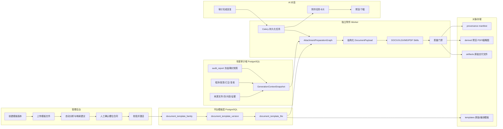
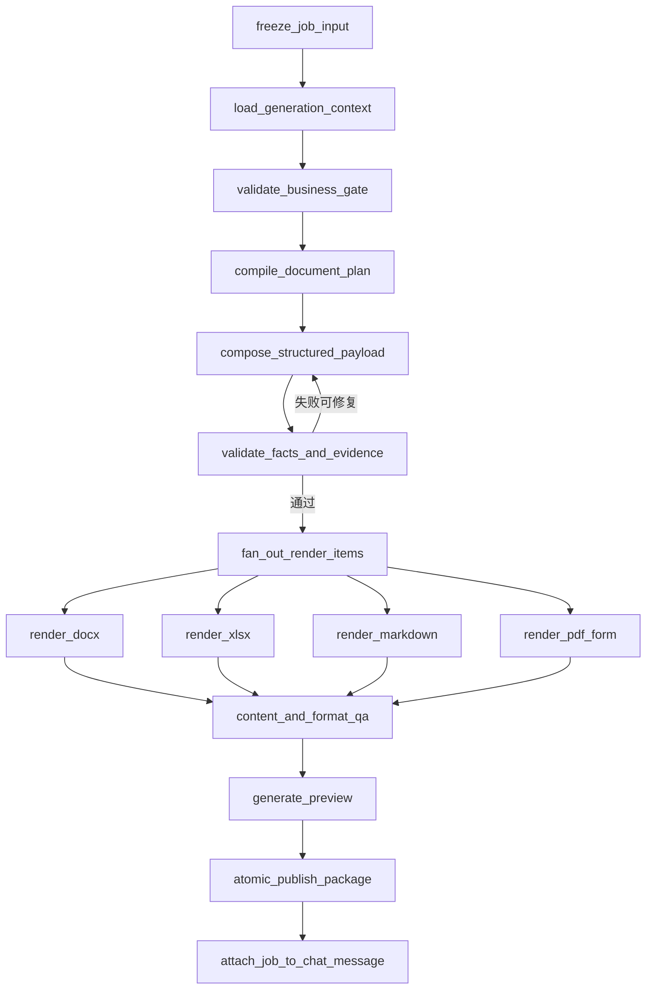
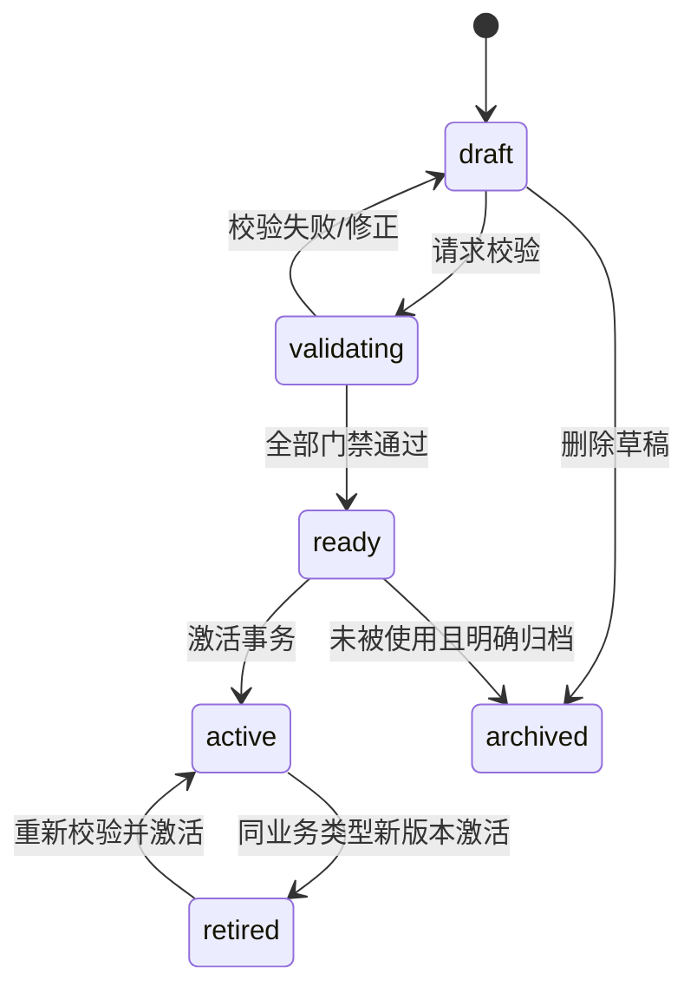
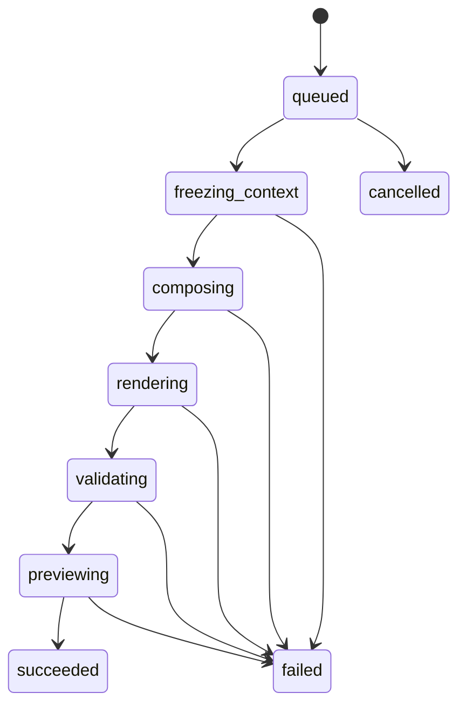

# 年度审计模板管理与附件生成方案

> 文档状态：建议实施方案
>
> 基线代码：`master@e415926`（2026-08-31）
>
> 适用范围：模板版本治理、年度审计附件编制、对话交付、预览与下载
>
> 核心结论：保留现有审计事实、证据、报告版本、权限和对象存储能力；重建模板治理与附件生成内核，不复活已删除的旧附件实现。

> 实施进度（2026-09-01）：Phase 0-4 的代码主链已落地，包括模板治理、人工预览确认激活、严格三表及附注合同、确定性渲染、后台任务、对话绑定、票据下载、对象引用账本和可复现部署合同。正式生产放行仍需完成 PostgreSQL、Redis、线上 MinIO、Celery、Gotenberg 和 ClamAV 联调、Linux 镜像构建，以及经授权脱敏黄金模板的业务视觉签字。

## 1. 结论先行

本功能可行，但不能把它实现成“把完整 AI 回复复制到 Word/Excel/PDF”或“让 LLM 自由修改 Office 二进制文件”。优质方案应明确分成四层：

1. **模板治理层**：管理员上传模板，系统在激活前把模板编译为经过人工确认的“字段/章节/表格槽位合同”。同一业务类型只允许一个激活版本。
2. **审计上下文层**：从项目主数据、冻结的报告事实快照、审计程序、结论、订正、材料和证据中构造统一的 `GenerationContextSnapshot`，而不是把聊天全文当成事实源。
3. **附件生成 Agent**：Agent 只负责理解模板语义、编制结构化内容和选择工具；所有公司名称、日期、金额、统一社会信用代码等确定性事实都通过事实引用写入，不允许模型自行创造。
4. **确定性渲染与质量门禁层**：DOCX、XLSX、Markdown、PDF 分别由成熟开源库渲染，再经格式、内容、证据、财务勾稽、分页和视觉预览校验后发布。

运行时规则是：

- 一个激活模板版本中有多少个可交付模板文件，就生成多少个交付文件；预览 PDF 不计入交付文件数量。
- 输出文件扩展名与模板的受支持原始扩展名一致；绝不把 `.xlsx` 模板伪装成 `.docx`，也不只改文件后缀。
- 客户附件正文不展示 `evidence_id`、`chunk_id`、`[[cite:n]]` 等内部标识，但每个字段和段落的来源保留在内部 provenance manifest 中。
- 没有激活模板、模板未通过编译、必填事实缺失、证据冲突或质量门禁失败时，明确阻断，绝不回退到“随便生成一个文件”。
- AI 生成的是待复核附件；正式签发仍受现有 release gate、复核和签字流程约束。

## 2. 当前代码基线与问题判断

### 2.1 已确认的现状

| 现状 | 代码依据 | 判断 |
|---|---|---|
| 完整年审对话通过 LangGraph 路由到年度报告子图 | `backend/ai_hunter/app/graph/main.py`、`backend/ai_hunter/annual_audit/report_graph.py:12` | 可复用现有路由、checkpoint 和对话持久化 |
| 报告已保存版本化的冻结事实快照 | `backend/ai_hunter/annual_audit/report_service.py:794`、`:943` | 是附件上下文的首要输入，不应重新从聊天反推 |
| 报告引用已有不可变 citation manifest | `backend/sql/annual_audit_postgres_v3.sql` | 可作为附件段落/字段来源清单 |
| 已有审计程序、发现、复核、签发门禁和签发 SHA | `backend/sql/annual_audit_postgres_v3.sql`、`execution_service.py` | 应继续作为生成和正式交付门禁 |
| MinIO 已支持成果物上传、读取和删除 | `backend/ai_hunter/app/services/minio_service.py:57` | 可扩展模板桶、预览派生物和流式下载 |
| 前端已有管理后台壳、统一鉴权请求和 PDF.js 预览 | `web/components/admin/admin-shell.tsx`、`web/lib/api/client.ts`、`web/components/shared/preview-host.tsx` | 可复用页面框架、SWR 模式和 PDF 预览 |
| 当前 `artifact_service` 手写最小 DOCX，并固定新建 MD/DOCX/XLSX | `backend/ai_hunter/annual_audit/artifact_service.py:142`、`:177` | 只能算内部草稿兼容实现，不能作为客户附件生成器 |
| 旧模板/附件路由、迁移和测试在最新提交中被删除 | `git show e415926` | 说明旧方案不应恢复，只能提取业务教训 |

### 2.2 当前仓库处于不一致过渡态

以下残留代码不能直接复活：

- `generic_template_repository.py:432` 仍查询 `annual_audit_template*`；该旧表族不属于当前 PostgreSQL 迁移清单，不能绕过模板治理重新启用。
- `file_attachment_service.py:25-30` 导入不存在的 `attachment_fact_policy`、`attachment_quality_service` 等模块，直接 import 会失败；该文件已膨胀为七千余行启发式渲染逻辑。
- 后端已经没有模板管理、附件生成、预览或下载 API，`backend/tests` 目录也被删除。
- 前端模板路由和附件接线已删除，但以下三个孤儿组件仍引用不存在的模块/API：
  - `web/components/admin/template-version-management.tsx`
  - `web/components/admin/template-version-files.tsx`
  - `web/components/chat/annual-audit-result-card.tsx`
- 本地 TypeScript 静态检查因此失败；38 类错误均集中在上述三个孤儿组件及其衍生类型。

因此 Phase 0 必须先删除或完全重写这些孤儿残留，使前后端恢复可构建、可测试的基线。不能在不可运行的旧实现上继续堆补丁。

### 2.3 现有数据仍不足以编制“公司基本情况”

当前项目画像主要具备公司名称、统一社会信用代码、年度和期间等字段，尚未形成下列可追溯的标准事实：

- 成立日期；
- 注册地址；
- 注册资本及币种；
- 股东/出资信息；
- 法定代表人；
- 分支机构；
- 治理结构；
- 经营范围。

这些信息不能由 Agent 根据公司名称猜测，也不能让上传文件覆盖项目主数据。需要增加规范化的项目事实及来源状态，见第 7 节。

## 3. 设计原则与承诺边界

### 3.1 必须坚持的原则

1. **事实与文稿分离**：数值和身份事实来自确定性数据；模型只负责编排和受约束的叙述性表达。
2. **模板与样例分离**：一个看起来像成品的文件不天然是可执行模板。激活前必须有明确槽位合同。
3. **生成与格式分离**：Agent 不直接写 OOXML/PDF；格式技能是有类型、可审计、无任意路径权限的工具。
4. **版本全部冻结**：一次生成同时冻结报告版本、事实快照 SHA、模板版本、模板文件 SHA、字段合同、模型版本、渲染器版本和字体镜像版本。
5. **证据不进正文但不丢失**：客户正文隐藏内部证据 ID，内部 manifest 保留字段/段落到证据的映射。
6. **失败显式化**：禁止静默复制模板、追加整段 AI 回复、清空未识别章节或用 0 填充未知金额。
7. **不可变交付**：已激活或已被生成任务使用的模板版本/文件不可物理删除；历史附件永远绑定生成当时的模板快照。

### 3.2 明确不承诺的能力

- 不承诺任意上传的 Word、Excel、PDF 可以在无人确认的情况下自动理解并达到像素级一致。
- 只对“受支持格式 + 已确认槽位合同 + 已安装字体 + 固定渲染器版本 + 通过黄金样本验收”的模板承诺高保真。
- LibreOffice 与 Microsoft Office 对复杂 SmartArt、特殊字体、域、分页和高级图表可能存在差异。
- `openpyxl` 不计算公式，也不能保证保留所有高级 shapes、ActiveX、pivot cache、外链和宏行为。
- 静态 PDF 不具备长文本自动重排能力；没有 AcroForm 或坐标/溢出合同的 PDF 不能激活为动态长文模板。
- `.doc`、`.xls`、`.docm`、`.xlsm` 第一阶段不作为正式交付模板。旧格式应离线转换、业务复核后以 `.docx`/`.xlsx` 重新上传。服务端 Office COM 自动化不进入生产方案。

## 4. 目标架构



### 4.1 存储职责

| 存储 | 职责 |
|---|---|
| PostgreSQL | 全部关系型业务与平台数据：模板 family/version/file、管理员权限、年审报告、事实快照、生成 job/item/artifact、业务状态、幂等与审计日志 |
| MinIO `templates` | 原始模板、编译后的可执行模板、模板预览和解析报告 |
| MinIO `artifacts` | 原扩展名交付文件和 provenance manifest |
| MinIO `derived` | DOCX/XLSX/MD 转换后的预览 PDF、页图和缩略图 |
| Redis | Celery broker、短期进度缓存；不作为任务或附件唯一事实源 |

模板、年审生成任务和业务事实都存储在同一 PostgreSQL 数据库。模板/快照 SHA、不可变 UUID 和持久化快照仍用于历史可复现；同库关联使用明确外键和单库事务，避免跨库一致性缺口。

## 5. 模板管理设计

### 5.1 页面与交互

新增管理菜单“附件模板”：

```text
/admin/templates
/admin/templates/{versionId}
```

列表列项：

| 字段 | 说明 |
|---|---|
| 版本名称 | 管理员填写，例如“2026 年度一般企业模板” |
| 业务类型 | `annual_audit`、`bookkeeping`、`tax_service` 等后端字典项 |
| 版本 | 后端事务自动生成 `v1`、`v2`，前端只读 |
| 描述 | 可选 |
| 文件数 | 当前版本可交付模板文件数 |
| 校验状态 | 草稿、扫描中、待映射、可激活、校验失败 |
| 激活开关 | 打开新版本时同业务类型旧版本自动关闭 |
| 更新时间/操作人 | 审计留痕 |
| 操作 | 详情、编辑草稿、复制为新版本、删除草稿 |

创建与上传分两步：

1. 创建版本只填写版本名称、业务类型和描述；服务端锁定业务类型 family 行并分配下一个版本号。
2. 进入版本详情后上传一个或多个模板文件，逐个确认“附件业务编码”和“附件显示名称”。

业务类型字典由后端返回 `generator_enabled`、`supported_formats` 和所需业务 profile。第一阶段年度审计为可生成状态；代理记账、税务业务可以先完成模板治理，但在各自上下文适配器上线前必须明确显示“生成能力未启用”，不能假装已经支持业务编制。

文件名只能用于预填建议，不能成为正式业务合同。管理员必须确认例如：

| `document_code` | 显示名称 | 推荐模板格式 |
|---|---|---|
| `audit_report` | 审计报告 | DOCX |
| `financial_statements` | 财务报表 | XLSX 或 DOCX |
| `financial_statement_notes` | 财务报表附注 | DOCX |
| `management_letter` | 管理建议书 | DOCX |
| `confirmation` | 函证 | DOCX/XLSX |
| `workpaper_*` | 审计工作底稿 | XLSX |

输出文件名固定由服务端生成：

```text
{净化后的项目名称}{附件显示名称}{可选序号}.{模板原扩展名}
```

例如：

```text
北京某某有限公司2025年度审计项目审计报告.docx
北京某某有限公司2025年度审计项目财务报表.xlsx
北京某某有限公司2025年度审计项目财务报表附注.docx
```

### 5.2 版本规则

- 版本号按业务类型递增，由数据库事务分配，禁止前端传入可信版本号，禁止裸 `MAX(version_no)+1`。
- 同一业务类型至多一个 active 版本。激活接口锁定 family 行，在一个事务内把旧版本转为 retired、目标版本转为 active。
- 草稿可修改名称、描述、文件和槽位合同。
- active/retired 版本内容不可修改；“修改”通过“复制为新版本”完成。这是审计可追溯要求，不是 UI 限制。
- 未使用草稿可删除；active、retired 或已被任务引用的版本只能归档，不能物理删除。
- 切回旧版本使用重新激活操作，旧版本必须重新通过当前渲染器和字体环境校验。

### 5.3 模板激活门禁

一个版本只有全部文件通过以下检查后才允许激活：

1. 扩展名、MIME、magic/container signature 一致；
2. 文件大小、ZIP entry 数、解压总量、压缩比和 XML 大小未超限；
3. ClamAV 扫描通过，无密码保护；
4. 不含宏、XLM、DDE、OLE、ActiveX、JavaScript 或未批准外链；
5. 每个文件都有唯一 `document_code`、显示名称和输出命名预览；
6. 模板编译成功，必填槽位、循环区和溢出策略完整；
7. 未解析占位符为 0；
8. 使用合成数据完成一次实际渲染，生成文件可被对应库重新打开；
9. 通过 Gotenberg 生成预览 PDF，无空白页异常、文字重叠、截断或不可读字体；
10. 管理员预览并确认槽位映射和视觉效果。

## 6. 模板合同与格式策略

### 6.1 为什么必须有槽位合同

“模板里出现一、公司的基本情况”只能说明该章节的业务语义，不能说明：

- 哪几段允许替换；
- 替换后是否可扩展到多段；
- 字体和段落样式取哪一个原型；
- 表格是否允许增加行；
- 缺失事实时留空、显示“未提供”还是阻断；
- 内容溢出如何处理；
- 哪些正文是固定法律措辞，绝不能被 Agent 改写。

因此上传后先由 Template Onboarding Agent 产生映射建议，管理员确认后形成不可变的 `binding_manifest`。运行时只执行 manifest，不再通过模糊文本匹配猜位置。

### 6.2 推荐模板编制模式

| 格式 | 生产级槽位 | 运行时库 | 说明 |
|---|---|---|---|
| DOCX | docxtpl/Jinja 标签、内容控件、书签或经确认的 OOXML 节点地址 | `docxtpl` + `python-docx` | 页眉页脚、样式、表格结构保留在原模板；动态段落/表格必须显式标记 |
| XLSX | Named Range、Excel Table、固定 Cell/Range、原型行 | `openpyxl` | 只写声明区域，不重建 workbook；公式和值策略显式配置 |
| MD | Jinja 变量/循环 | `Jinja2 SandboxedEnvironment` + `StrictUndefined` | 禁 raw HTML、外链和任意对象访问 |
| PDF | 命名 AcroForm；或经人工确认的坐标/字体/长度合同 | `pypdf` + `ReportLab` | 静态长文 PDF 不支持自由重排；叙述型 PDF 应由 DOCX/XLSX/MD 生成预览/交付 PDF |

对没有任何槽位的现有成品样例，系统可以自动给出建议，但必须满足以下之一才能激活：

- 系统生成一个同扩展名的“编译模板”，管理员预览确认后保存；
- 管理员在 Word/Excel 中按规范补充标签/Named Range 后重新上传；
- 对 PDF 明确配置表单字段或坐标合同。

原始模板和编译模板都保存，分别记录 SHA。生成任务使用编译模板 SHA，确保以后切换模板或重新编译不会改变历史产物。

### 6.3 示例合同

```json
{
  "contract_version": "1.0",
  "document_code": "financial_statement_notes",
  "source_template_sha256": "...",
  "slots": [
    {
      "slot_id": "company_overview",
      "target": "docx:content-control:company_overview",
      "value_type": "narrative_blocks",
      "source": "document.company_profile.overview",
      "required": true,
      "style_policy": "inherit_template",
      "overflow_policy": "continue_paragraphs"
    },
    {
      "slot_id": "statement_rows",
      "target": "xlsx:table:ATA_BALANCE_SHEET",
      "value_type": "table_rows",
      "source": "document.financial_statements.balance_sheet",
      "required": true,
      "style_policy": "clone_prototype_row"
    }
  ],
  "fixed_regions": ["audit_opinion_legal_wording"],
  "forbidden_output_patterns": ["[[cite:", "evidence_id", "chunk_id"]
}
```

## 7. 统一审计上下文与语义编制

### 7.1 事实优先级

附件事实按以下优先级解析：

1. 项目主数据：被审计单位、统一社会信用代码、审计期间等；上传文件不得覆盖。
2. 已批准的订正 ledger。
3. 报告版本冻结的结构化事实与审定数据。
4. 审计程序结论、发现解决状态和 release gate。
5. 有规范 evidence locator 的材料抽取事实。
6. 当前对话/报告文稿只作为叙述候选，不作为新的权威事实。

同一事实存在冲突时标记 `conflicted` 并阻断必填槽位，禁止模型自行选择一个看似合理的值。

### 7.2 标准事实结构

建议增加规范化 `annual_engagement_fact`，或以同等可查询能力扩展项目画像。每个事实必须具备：

```json
{
  "fact_key": "entity.registered_capital",
  "value": {"amount": "3000000.00", "currency": "CNY"},
  "display_value": "300万元人民币",
  "status": "confirmed",
  "source_kind": "material_extraction",
  "evidence_refs": [
    {
      "source_file_id": 123,
      "source_page_id": 456,
      "source_chunk_id": "...",
      "locator_kind": "pdf_page"
    }
  ],
  "revision": 2,
  "reviewed_by": "user-id"
}
```

公司基本情况至少定义：

```text
entity.legal_name
entity.short_name
entity.uscc
entity.incorporation_date
entity.registered_address
entity.registered_capital
entity.shareholders[]
entity.legal_representative
entity.branches[]
entity.governance_structure
entity.business_scope[]
```

### 7.3 冻结的生成上下文

`GenerationContextSnapshot` 至少包含：

```json
{
  "engagement": {},
  "entity_facts": {},
  "report": {
    "report_id": 88,
    "report_version": 3,
    "fact_snapshot_sha256": "...",
    "opinion_type": "draft_unmodified"
  },
  "financial_statements": {},
  "audit_program": [],
  "findings": [],
  "corrections": [],
  "reviews": [],
  "release_gate": {},
  "materials": [],
  "evidence_manifest": {},
  "policy_binding": {},
  "generation_policy_version": "annual-attachment-v1"
}
```

该快照可压缩存对象存储，数据库只保存引用、SHA 和可查询摘要。大对象不能塞进聊天消息或 Celery 消息。

### 7.4 Agent 如何编制“公司基本情况”

Agent 不是把聊天中的相关段落复制出来，而是接收公司事实和模板章节目标，输出结构化 `NarrativeBlock`：

```json
{
  "section_id": "company_overview",
  "blocks": [
    {
      "kind": "paragraph",
      "segments": [
        {"text": "北京某某有限公司（以下简称“本公司”）于"},
        {"fact_ref": "entity.incorporation_date"},
        {"text": "登记设立，统一社会信用代码为"},
        {"fact_ref": "entity.uscc"},
        {"text": "，注册地址为"},
        {"fact_ref": "entity.registered_address"},
        {"text": "。"}
      ],
      "evidence_refs": ["internal-evidence-ref-1", "internal-evidence-ref-2"]
    }
  ]
}
```

金额、日期、证件号和主体名称由渲染前的事实解析器替换，Agent 只引用 `fact_ref`。这样即使模型表达发生变化，也无法凭空改写注册资本或信用代码。

若注册地址缺失，槽位合同决定行为：

- `required=true`：任务阻断并提示补充/确认资料；
- `required=false, missing_policy=omit_sentence`：删除对应句段；
- 不允许默认生成“地址不详”或从互联网猜测。

## 8. 附件生成 Agent 与后台任务

### 8.1 Agent 的职责边界

专用 `AttachmentPreparationGraph` 使用现有 LangGraph，但运行在独立 Celery worker 中。它负责：

- 冻结报告、模板和上下文版本；
- 根据每个模板的 document schema 编制结构化内容；
- 为每个叙述断言绑定事实/证据；
- 选择对应格式 skill；
- 根据校验结果修复结构化内容或失败退出。

它不负责：

- 任意读取服务器路径；
- 直接操作 MinIO key；
- 手工拼 OOXML/PDF；
- 修改模板未声明区域；
- 绕过事实、证据、复核或交付门禁。

### 8.2 图节点



### 8.3 Skill 接口

Skills 是后端内部的类型化工具适配器，不是可访问任意文件系统的通用脚本：

```python
inspect_template(template_file_id: UUID) -> TemplateInspection
compile_template(template_file_id: UUID, approved_mapping: Mapping) -> CompiledTemplate
render_docx(compiled_template_id: UUID, payload_id: UUID) -> RenderResult
render_xlsx(compiled_template_id: UUID, payload_id: UUID) -> RenderResult
render_markdown(compiled_template_id: UUID, payload_id: UUID) -> RenderResult
render_pdf_form(compiled_template_id: UUID, payload_id: UUID) -> RenderResult
convert_preview(artifact_id: UUID) -> PreviewResult
validate_artifact(artifact_id: UUID) -> QualityReport
publish_artifact(artifact_id: UUID) -> PublishedArtifact
```

工具入参只传稳定 ID；worker 自己做 ACL、SHA 和状态校验。Agent 无法指定本地绝对路径、bucket 或任意命令。

### 8.4 为什么使用 Celery

附件生成涉及 LLM、Office 解析、LibreOffice 转换和多文件校验，不应运行在 FastAPI 请求或当前上传用的进程内 `ThreadPoolExecutor` 中。推荐 `Celery + 现有 Redis broker`：

- API 只创建 job/outbox 并返回 `202`；
- Celery 消息只放 `job_id`，不放报告或文件大对象；
- PostgreSQL 是任务状态真相，Redis/Celery result 不是业务真相；
- 生产环境为 Celery 使用独立 Redis 实例或至少独立 logical DB、ACL 和 `noeviction` 策略，不能与可淘汰的 heavy cache 混用；
- 任务幂等、允许 worker 崩溃后重投；
- 每个模板文件一个 job item，可并行生成；
- 所有必需 item 通过后再原子发布整个 package；部分成功文件内部保留供重试，但不作为完整交付包展示。

生成幂等键：

```text
sha256(engagement_id + report_id + report_version +
       template_version_id + fact_snapshot_sha256 + request_scope)
```

相同输入重复点击返回同一成功/运行中 job；补充资料、订正报告或切换模板后会形成新 job。

## 9. 数据模型

### 9.1 PostgreSQL：平台模板表

#### `document_template_family`

| 字段 | 说明 |
|---|---|
| `id UUID PK` | 稳定主键 |
| `business_type` | 业务类型，在同一 scope 内唯一 |
| `active_version_id UUID NULL` | 当前激活版本的唯一权威指针 |
| `next_version_no INT` | 在 family 行锁内分配版本号 |
| `scope_type/scope_key` | 初期固定 `system/system`，为未来 `company/{company_id}` 模板预留 |
| `revision` | 乐观锁 |
| 审计字段 | created/updated by/at |

约束：`UNIQUE(scope_type, scope_key, business_type)`。

#### `document_template_version`

| 字段 | 说明 |
|---|---|
| `id UUID PK` | 前端详情路由使用，不使用业务字段拼主键 |
| `family_id UUID FK` | 所属业务类型 |
| `version_no INT` | 自动生成，family 内唯一 |
| `version_label` | 服务端生成 `v{version_no}` |
| `name/description` | 管理信息 |
| `status` | draft/validating/ready/active/retired/archived |
| `contract_version` | 模板合同协议版本 |
| `manifest_json` | 版本级交付清单和策略 |
| `content_sha256` | 所有 ready 文件及合同的稳定摘要 |
| `validation_report_json` | 激活门禁结果 |
| 审计字段 | created/updated/activated by/at |

约束：`UNIQUE(family_id, version_no)`。真正的 active 唯一性由 `family.active_version_id` 和事务保证，避免同时维护两个互相冲突的 active 真相。

#### `document_template_file`

| 字段 | 说明 |
|---|---|
| `id UUID PK` | 稳定文件 ID |
| `template_version_id UUID FK` | 所属版本 |
| `document_code` | 附件业务编码，同版本内唯一 |
| `display_name` | 输出命名使用 |
| `source_file_name/extension/content_type/size` | 原始文件元数据 |
| `source_object_ref/source_sha256` | 原始模板 |
| `compiled_object_ref/compiled_sha256` | 可执行模板 |
| `renderer_profile` | docxtpl/openpyxl/jinja/pdf_acroform/pdf_overlay |
| `binding_manifest_json` | 已确认的槽位合同 |
| `inspection_report_json` | 结构、字体、外链、宏、表单等分析结果 |
| `preview_object_ref` | 激活前模板预览 |
| `status` | uploaded/scanning/mapping/ready/invalid/archived |
| `sort_order` | 确定交付顺序 |

同一个版本允许多个文件，也允许未来一个业务种类有多份文件；每个 ready 文件严格产生一个交付 artifact。

### 9.2 PostgreSQL：年度审计生成表

#### `annual_engagement_fact`

补齐公司基本情况等规范事实，不重复存储已有财务明细表：

| 字段 | 说明 |
|---|---|
| `id/engagement_id` | 事实版本及所属项目 |
| `fact_key` | 例如 `entity.registered_address` |
| `value_json/display_value/data_type` | 原值、展示值和类型 |
| `status` | candidate/confirmed/conflicted/rejected |
| `source_kind/source_ref_json` | master/profile/material/correction/calculation |
| `evidence_refs_json` | 来源 locator 摘要 |
| `revision/is_current` | 版本与当前指针 |
| `reviewed_by/reviewed_at` | 人工确认 |

约束：同一项目、fact key、revision 唯一；更新当前值时在事务内关闭旧 `is_current`。报告生成时把实际采用的事实版本及 SHA 冻结进 fact snapshot。

#### `annual_attachment_generation_job`

| 字段 | 说明 |
|---|---|
| `id CHAR(36) PK` | UUID，与 Celery task id 分离 |
| `engagement_id/report_id/report_version` | 冻结报告身份 |
| `thread_id/assistant_turn_id` | 对话消息绑定摘要，并以同库外键或受控引用保持完整性 |
| `template_family_id/template_version_id` | 冻结模板身份 |
| `template_snapshot_json/template_content_sha256` | 冻结模板快照 |
| `fact_snapshot_ref/fact_snapshot_sha256` | 冻结生成上下文 |
| `idempotency_key` | 唯一 |
| `status/stage/progress` | 任务状态 |
| `expected_item_count/succeeded_item_count` | 数量不变量 |
| `error_code/error_summary` | 脱敏错误 |
| `model_manifest_json` | 模型、prompt、Agent graph 版本 |
| `renderer_manifest_json` | 库、LibreOffice、字体镜像版本 |
| 审计时间 | queued/started/completed/cancelled at |

#### `annual_attachment_generation_item`

| 字段 | 说明 |
|---|---|
| `id CHAR(36) PK` | 每模板文件一个 item |
| `job_id` | 所属 job |
| `template_file_id/document_code` | 冻结模板文件 |
| `source_template_sha256/compiled_template_sha256` | 模板身份 |
| `status/stage/attempt_count` | item 状态 |
| `payload_ref/payload_sha256` | 结构化 DocumentPayload |
| `quality_report_json` | 校验结果 |
| `error_code/error_summary` | 失败原因 |

约束：`UNIQUE(job_id, template_file_id)`。

#### `annual_generated_artifact`

| 字段 | 说明 |
|---|---|
| `id CHAR(36) PK` | 对话、下载和签发使用的稳定 artifact id |
| `job_id/item_id` | 来源任务 |
| `engagement_id/report_id/template_version_id/template_file_id` | 完整版本链 |
| `document_code/display_name/file_name` | 交付语义和文件名 |
| `extension/content_type/file_size/sha256` | 容器信息 |
| `object_ref` | 原格式交付物 |
| `preview_ref/preview_sha256` | 派生 PDF |
| `provenance_manifest_ref/provenance_sha256` | 字段/段落证据链 |
| `status/delivery_approved` | internal/validated/published/rejected |
| `supersedes_artifact_id` | 重生成链 |
| 审计字段 | created/published by/at |

#### `annual_attachment_outbox`

job 与 outbox 在同一 PostgreSQL 事务创建。dispatcher 把未发布 outbox 发送到 Celery，发送成功后记账。即使 API 或 Redis 短暂故障也不会丢任务。

### 9.3 迁移编号

当前年度审计关系模型以 `annual_audit_postgres_v3.sql` 为基线，并由单一 PostgreSQL 迁移器记录和执行。因此：

- 新的年度生成表与审计基础表在 `annual_audit_postgres_v3.sql` 中以幂等 DDL 创建；
- 模板表继续使用独立的 `document_template_*` 表名，不复用旧 `annual_audit_template_*`；
- 所有模板、生成任务、outbox 和审计记录在同一 PostgreSQL 数据库内迁移；
- 启动时只根据 PostgreSQL 迁移记录判断已应用版本，不自动删除或覆盖历史数据；
- 若需要迁移历史模板，另写一次性、可回滚的显式迁移工具，并核对文件 SHA、业务类型和所有权。

## 10. 状态机、并发与原子性

### 10.1 模板版本状态



### 10.2 生成任务状态



关键不变量：

- `succeeded_item_count == expected_item_count` 才能把 job 标记为 `succeeded`。
- 3 个 ready 模板文件必须得到 3 个 `delivery_approved=true` 的 artifact；否则整个交付包不成功。
- 预览文件、manifest、日志不计入交付数量。
- job 创建后模板切换不影响该 job；它只使用被冻结的 template version/file SHA。
- 重新生成创建新 job/artifact，不覆盖旧对象。

### 10.3 激活并发

激活伪流程：

```text
BEGIN
SELECT * FROM document_template_family WHERE id=? FOR UPDATE
SELECT * FROM document_template_version WHERE id=? FOR UPDATE
校验 target.status == ready 且 validation/content SHA 未过期
把当前 active 版本标为 retired（若有）
把目标版本标为 active
更新 family.active_version_id 和 revision
写模板审计日志
COMMIT
```

API 使用 `If-Match: revision` 或请求体 revision 防止两个管理员覆盖彼此操作。

## 11. API 设计

### 11.1 管理后台 API

| 方法 | 路径 | 用途 |
|---|---|---|
| GET | `/api/admin/template-business-types` | 返回业务类型和已安装生成 profile |
| GET | `/api/admin/template-versions` | 分页/筛选版本列表 |
| POST | `/api/admin/template-versions` | 创建草稿，服务端分配 vN |
| GET | `/api/admin/template-versions/{version_id}` | 版本、文件、合同和校验详情 |
| PATCH | `/api/admin/template-versions/{version_id}` | 修改草稿名称/描述，需 revision |
| POST | `/api/admin/template-versions/{version_id}/clone` | 复制为下一版本 |
| DELETE | `/api/admin/template-versions/{version_id}` | 删除未使用草稿；其他状态返回 409 |
| POST | `/api/admin/template-versions/{version_id}/files` | multipart 上传模板文件 |
| PATCH | `/api/admin/template-files/{file_id}` | 修改草稿文件业务编码/显示名/映射 |
| DELETE | `/api/admin/template-files/{file_id}` | 删除草稿文件 |
| POST | `/api/admin/template-files/{file_id}/inspect` | 重新分析模板 |
| POST | `/api/admin/template-files/{file_id}/compile` | 保存人工确认映射并编译 |
| GET | `/api/admin/template-files/{file_id}/preview` | 激活前 PDF 预览 |
| POST | `/api/admin/template-versions/{version_id}/validate` | 执行激活门禁 |
| PUT | `/api/admin/template-versions/{version_id}/activation` | `{active:true|false, revision}` |

模板全局写操作第一阶段仅允许 `is_super_admin=true`。当前 company admin 可能通过通用 module 获得较宽权限，仅使用 `require_module("admin")` 不足以保护全局模板。若以后支持机构级模板，再按 `scope_type/scope_id` 和 company ACL 放开。

### 11.2 年审附件 API

| 方法 | 路径 | 用途 |
|---|---|---|
| POST | `/api/annual-audit/{case_id}/attachment-jobs` | 创建任务，返回 202 和 job 快照 |
| GET | `/api/annual-audit/{case_id}/attachment-jobs/{job_id}` | 状态、阶段、item 和可交付 artifact |
| POST | `/api/annual-audit/{case_id}/attachment-jobs/{job_id}/retry` | 使用同一冻结输入重试失败 item，或显式创建新 job |
| POST | `/api/annual-audit/{case_id}/attachment-jobs/{job_id}/cancel` | 取消尚未发布任务 |
| GET | `/api/annual-audit/{case_id}/artifacts/{artifact_id}/download-ticket` | ACL 后签发短期下载票据 |
| GET | `/api/annual-audit/{case_id}/artifacts/{artifact_id}/preview-ticket` | ACL 后签发短期预览票据 |
| GET | `/api/annual-audit/{case_id}/attachment-jobs` | 项目附件历史 |

创建请求示例：

```json
{
  "report_id": 88,
  "assistant_turn_id": "turn-uuid-assistant",
  "generation_scope": "all_active_template_files",
  "delivery_level": "review_draft",
  "idempotency_key": "client-generated-key"
}
```

服务端不接受客户端指定模板 storage ref、输出扩展名或任意文件名。

错误约定：

- `409 NO_ACTIVE_TEMPLATE`：当前业务没有激活版本；
- `409 REPORT_SNAPSHOT_STALE`：报告已因订正产生新版本；
- `409 TEMPLATE_VERSION_IMMUTABLE`：修改/删除已发布版本；
- `422 TEMPLATE_VALIDATION_FAILED`：模板合同或安全校验失败；
- `422 REQUIRED_FACT_MISSING`：必填事实缺失；
- `422 FACT_CONFLICTED`：事实冲突；
- `423 GENERATION_IN_PROGRESS`：同一幂等输入已在生成；
- `403`：无模板管理或项目/报告访问权限。

## 12. 对话集成

### 12.1 触发策略

推荐默认流程：

1. `audit.full` 完成并保存 report version/fact snapshot。
2. 若存在激活模板且报告达到 `completed_for_generation`，自动创建 `review_draft` 生成任务；也可通过“生成附件”命令显式触发。
3. 本轮 assistant 的 `graph_context` 和 SSE `final` metadata 只保存 `job_id`、report/template version 摘要，不保存文件内容或 MinIO ref。
4. 前端显示与该 assistant 版本绑定的任务卡。非终态轮询 job API，终态停止。
5. 页面刷新时由历史 `AssistantTurnItem` 恢复相同 job，不查询“项目最新附件”去覆盖历史回复。

正式签发附件与 AI 草稿必须区分：

| 交付级别 | 门禁 | UI |
|---|---|---|
| `review_draft` | 报告事实快照可用、模板有效 | 明确标记“待复核草稿” |
| `final_candidate` | 项目复核通过、release gate ready | 标记“待签字/签发” |
| `issued` | 现有签发 API、人类签字和 SHA 固化 | 正式附件，只读 |

### 12.2 前端组件

建议新增而不是复活旧孤儿组件：

```text
web/app/(admin)/admin/templates/page.tsx
web/app/(admin)/admin/templates/[versionId]/page.tsx
web/components/admin/attachment-template-version-list.tsx
web/components/admin/attachment-template-version-dialog.tsx
web/components/admin/attachment-template-files.tsx
web/components/chat/generated-artifact-list.tsx
web/lib/backend/attachment-templates.ts
web/lib/backend/generated-artifacts.ts
web/lib/hooks/use-attachment-templates.ts
web/lib/hooks/use-attachment-job.ts
```

`GeneratedArtifactList` 放在 `MessagePrimitive.Parts` 下方，数据绑定具体 assistant message。卡片显示：

- 模板版本和报告版本；
- 生成状态、当前阶段、成功数量/总数；
- 每个文件的名称、格式、大小、SHA 摘要、质量状态；
- 预览和下载按钮；
- 失败 item 的可读错误和重试操作；
- 草稿/待签发/已签发状态。

### 12.3 预览与下载

- DOCX/XLSX 预览：Gotenberg/LibreOffice 生成派生 PDF，前端继续使用现有 `react-pdf`/PDF.js。
- MD 预览：受控渲染为 PDF 或经过严格净化的文本视图。
- PDF 模板：原 PDF 可直接预览；仍通过授权票据访问。
- 下载始终返回原格式 artifact。
- 消息中只持久化 artifact id，不持久化长期签名 URL。
- 点击时获取短期 ticket；ticket 绑定用户、case、artifact、用途和过期时间。
- PDF 预览支持 CORS 和 Range；大文件下载使用对象存储代理/短签名流，不把整文件读入 FastAPI 内存。
- 移动端使用全屏 Dialog/Sheet，不沿用固定 420px 侧栏。

## 13. 格式渲染细则

### 13.1 DOCX

推荐 `docxtpl + python-docx`：

- 使用 Word 模板本身定义字体、段落、标题、表格、页眉页脚和 section；
- 普通变量写入同一 run 时继承模板样式；
- 动态段落、表格行、图片必须使用 docxtpl 专用 tag/显式合同；
- 固定法律措辞、审计意见标准段落设置为不可编辑 region；
- 不通过 `paragraph.text = ...` 重写整段，不自行拼最小 OOXML；
- 渲染后保留 styles、numbering、theme、headers、footers、media、section properties 等未声明 part；
- TOC、页码和域更新交给 LibreOffice 预览流程，并记录差异边界。

`docxtpl` 为 LGPL-2.1。若法务不能接受，应使用 MIT `python-docx` 和更严格的内容控件/书签合同，但不要自行扩张为通用 OOXML 模板引擎。

### 13.2 XLSX

继续使用现有 `openpyxl`：

- `load_workbook` 打开模板，只写 Named Range、Excel Table 或明确 range；
- 动态行从模板原型行复制 style、row height、number format、border、alignment 和允许的 formula；
- 保留 merged cells、print area、page setup、freeze panes、defined names；
- 默认把审计事实写为 value，不让 LLM 生成公式；
- 写入字符串若以 `= + - @` 起始，按数据值转义，防止公式注入；
- 输出后重新打开并检查公式、外链、命名范围、合并区域和工作表数量；
- 使用 LibreOffice 在隔离副本中重算/生成预览，原下载文件仍是模板扩展名。

为避免 XML bomb，应显式增加 `defusedxml`。高级 shapes/宏/外链无法保证时在激活阶段阻断。

### 13.3 Markdown

- 使用 `Jinja2 SandboxedEnvironment`、`StrictUndefined` 和 filter allowlist；
- 上下文只包含 JSON primitive/只读结构，不暴露 Python 对象；
- 禁止 include/import、任意 attribute、raw HTML、脚本和外部网络；
- 限制循环数量、递归、输出大小、CPU 和内存；
- Markdown 原文件交付，Gotenberg Chromium 只生成预览 PDF。

### 13.4 PDF

仅支持：

1. 命名 AcroForm：`pypdf` 填字段并 flatten；
2. 固定坐标 overlay：管理员配置页码、坐标、字体、字号、对齐、最大行数和溢出策略，ReportLab 生成透明层后由 pypdf 合并。

不支持：扫描/静态 PDF 中“找到一段文字后自动替换成任意长文”。若审计附注需要动态多页内容，模板源格式必须是 DOCX/MD/HTML，再导出 PDF。

## 14. 内容、格式与审计质量门禁

### 14.1 内容门禁

- 所有 required slot 已填充；
- 所有事实引用存在且状态为 confirmed/approved；
- 所有叙述性 claim 至少关联一个事实或证据；
- 公司名称、USCC、期间、报表金额与冻结快照完全一致；
- 资产负债表、利润表、现金流量表及附注勾稽通过；
- 报表与附注明细一致，差异为 0 或在批准阈值内并有说明；
- 无未解析占位符、模板说明、作者批注或测试数据；
- 无 `[[cite:]]`、`evidence_id`、`chunk_id`、MinIO ref、prompt、模型内部说明；
- 未知事实不被写成 0、无异常或肯定性结论；
- 文稿不超出当前审计自动化范围和 release gate 状态。

### 14.2 格式门禁

- 扩展名、MIME 和文件 signature 一致；
- DOCX/XLSX/PDF 可被对应解析库重新打开；
- 模板未声明的结构 part hash 不变，允许修改 part 在 manifest 中列明；
- 样式、页眉页脚、section、合并单元格、打印区域和关键表格结构未丢失；
- Gotenberg 预览成功，页数、纸张、方向满足合同；
- 无文字重叠、截断、极小字号、表格越界、异常空白页；
- 所需字体均安装，缺失字体直接阻断，不静默替换后宣称高保真；
- 输出文件名净化、防路径穿越、Windows 保留名和重复冲突。

### 14.3 provenance manifest

每个 artifact 保存独立 manifest：

```json
{
  "artifact_id": "...",
  "report": {"id": 88, "version": 3, "snapshot_sha256": "..."},
  "template": {"version_id": "...", "file_id": "...", "sha256": "..."},
  "renderer": {"name": "docxtpl", "version": "...", "image_digest": "..."},
  "model": {"provider": "...", "model": "...", "prompt_version": "..."},
  "slots": [
    {
      "slot_id": "company_overview",
      "payload_sha256": "...",
      "fact_refs": ["entity.legal_name", "entity.uscc"],
      "evidence_refs": ["..."],
      "validation": "passed"
    }
  ],
  "quality_report_sha256": "...",
  "output_sha256": "..."
}
```

客户只下载附件；审计人员在内部证据界面可查看 manifest 对应的来源。

## 15. 安全设计

### 15.1 上传安全

上传防护遵循 [OWASP File Upload Cheat Sheet](https://cheatsheetseries.owasp.org/cheatsheets/File_Upload_Cheat_Sheet.html) 的纵深防御原则：

- allowlist：第一阶段仅 `.docx`、`.xlsx`、`.md`、`.pdf`；
- 校验扩展名、MIME、magic、OOXML 必需 entries 和 PDF header；
- 随机对象 key，原始文件名仅作显示元数据；
- 限制文件大小、ZIP entries、单 entry、解压总量、压缩比、XML 深度；
- ClamAV 独立服务扫描；可用 `oletools` 检查 VBA/XLM/DDE/OLE；
- 拒绝密码保护、宏、ActiveX、嵌入可执行对象、远程模板和外部数据连接；
- 模板与材料均是 untrusted input，不能作为系统 prompt 或工具指令解释；
- 原模板、编译模板和产物放不同前缀/桶，最小权限访问。

### 15.2 Worker 和转换服务

- Celery renderer worker 与 FastAPI 分容器；
- 非 root、只读 rootfs、临时目录配额、CPU/内存/时间限制；
- 默认无外网；Gotenberg 只允许 worker 所在内网访问；
- [Gotenberg outbound filtering](https://gotenberg.dev/docs/outbound-url-filtering) 设为拒绝，容器网络层再次禁外网；
- 宏执行关闭，外链内容不解析；
- 每任务独立临时目录，完成后清理；
- LibreOffice worker 控制并发，防止 profile 目录污染和资源争用；
- 日志不记录文稿正文、证件号、完整对象 ref 或签名 URL。

### 15.3 下载权限

- 每次下载/预览先执行当前 user、company、case、report section 权限检查；
- artifact id 不可枚举，且不能仅凭 UUID 绕过 case ACL；
- ticket 短期有效、单用途、可审计，可选择一次性；
- `Content-Disposition` 使用 RFC 5987 UTF-8 文件名；
- 支持 Range、限速和大小上限；
- 下载、预览、失败和签发均写审计日志。

## 16. 开源组件选择

| 能力 | 推荐组件 | 许可证 | 使用边界 |
|---|---|---|---|
| DOCX 模板 | [docxtpl](https://docxtpl.readthedocs.io/en/latest/) | LGPL-2.1 | 需显式 tag/槽位；复杂动态内容必须激活前测试 |
| DOCX 结构 | [python-docx](https://python-docx.readthedocs.io/en/latest/) | MIT | 检查和少量定点操作，不自建通用 OOXML 引擎 |
| XLSX | [openpyxl](https://openpyxl.readthedocs.io/en/stable/) | MIT/Expat | 不计算公式；高级对象/宏不能保证 |
| XML 防护 | [defusedxml](https://github.com/tiran/defusedxml) | PSF | 限制恶意 XML |
| Markdown 模板 | [Jinja2 sandbox](https://jinja.palletsprojects.com/en/stable/sandbox/) | BSD-3-Clause | sandbox 仍需资源限制和严格上下文 |
| PDF 表单/合并 | [pypdf forms](https://pypdf.readthedocs.io/en/stable/user/forms.html) | BSD-3-Clause | AcroForm/overlay；不做静态长文重排 |
| PDF overlay | [ReportLab](https://docs.reportlab.com/) | BSD | 固定坐标和字体合同 |
| Office/MD 预览 | [Gotenberg](https://gotenberg.dev/docs/convert-with-libreoffice/convert-to-pdf) | MIT | 内网隔离；固定镜像 digest |
| Office 转换 | [LibreOffice](https://www.libreoffice.org/licenses/) | MPL-2.0/LGPL-3.0+ | 与 MS Office 非 1:1；字体必须固定 |
| 前端 PDF | [PDF.js](https://github.com/mozilla/pdf.js/) | Apache-2.0 | 复用现有前端能力 |
| 后台任务 | [Celery](https://docs.celeryq.dev/en/stable/) | BSD | Redis 只作 broker；状态真相写 PostgreSQL |
| 病毒扫描 | [ClamAV](https://docs.clamav.net/manual/Usage/ClamdProtocol.html) | GPL-2.0 | 独立服务通过 INSTREAM 扫描 |
| Office 威胁检测 | [oletools](https://github.com/decalage2/oletools) | BSD-like | 安装 extras 前需做 SBOM/许可证审核 |
| 中文 fallback 字体 | [Noto CJK](https://github.com/googlefonts/noto-cjk/) | OFL-1.1 | 字体度量不同，不能替代模板指定字体承诺 |

Gotenberg 官方也明确说明 LibreOffice 不是 Microsoft Office 的 1:1 实现，复杂样式可能有差异；因此依赖版本和字体镜像必须固定，升级必须先跑黄金模板集。

不建议核心链采用：

- 服务端 Microsoft Office COM：[微软不支持无人值守的 server-side Office automation](https://support.microsoft.com/en-us/topic/considerations-for-server-side-automation-of-office-48bcfe93-8a89-47f1-0bce-017433ad79e2)，存在死锁、损坏、安全和授权风险；
- Pandoc `reference.docx`：适合样式参考和格式迁移，不会把 reference 文档正文当作任意客户模板填充；
- Node Docxtemplater 全功能模块：关键图片、HTML、XLSX、样式等模块存在商业授权边界；
- Carbone Community：当前许可不是常规宽松开源许可，未经法务/商业授权不作为核心依赖；
- ONLYOFFICE DocumentServer：当前只需预览，AGPL 集成成本明显高于 Gotenberg + PDF.js。

如果黄金模板证明 Python 路线无法满足某一类经批准模板，可单独评估 Apache-2.0 的 [docx4j](https://github.com/plutext/docx4j) 与 [JXLS](https://jxls.sourceforge.net/) Java renderer sidecar；它是有证据后的格式适配升级，不是第一阶段同时维护第二技术栈。

## 17. 代码落点

### 17.1 后端建议目录

```text
backend/ai_hunter/document_templates/
  api.py
  schemas.py
  repository.py
  service.py
  compiler/
    docx.py
    xlsx.py
    markdown.py
    pdf.py

backend/ai_hunter/annual_audit/attachments/
  agent_graph.py
  context_service.py
  fact_registry.py
  content_schemas.py
  repository.py
  job_service.py
  provenance.py
  quality_service.py
  renderers/
    docx.py
    xlsx.py
    markdown.py
    pdf.py

backend/ai_hunter/app/api/routes_templates.py
backend/ai_hunter/app/api/routes_artifacts.py
backend/ai_hunter/app/workers/attachment_tasks.py
backend/sql/annual_audit_postgres_v3.sql
backend/sql/document_templates_postgres_v1.sql
```

职责必须拆分，禁止再次形成一个七千行以上、同时负责解析、业务事实、渲染、校验、上传和 API 的单文件服务。

### 17.2 与现有模块的集成

| 现有模块 | 动作 |
|---|---|
| `annual_audit/report_service.py` | 继续生成/冻结报告事实；移除“客户交付附件”职责，只返回 report id/version/snapshot |
| `annual_audit/report_graph.py` | `audit.full` 后调用 `enqueue_attachment_job`；增加 `delivery.generate` capability 可显式触发 |
| `annual_audit/artifact_service.py` | 标记为 internal draft compatibility；不得返回为模板附件，稳定后淘汰 |
| `annual_audit/generic_template_repository.py` | 不直接复活；迁移可用行为测试后由新平台 repository 取代 |
| `annual_audit/file_attachment_service.py` | 不继续维护；按 compiler/context/renderers/quality/jobs 拆解重建 |
| `app/services/minio_service.py` | 增加 templates 上传、metadata、stream/range、ticket 所需能力 |
| `app/repositories/conversation_message_repo.py` | 在 message graph_context/专用绑定中保存 job id，历史 DTO 同步返回 |
| `app/api/routes_chat.py` | SSE final 与历史 assistant item 增加稳定的 attachment job metadata |
| `app/auth/permissions.py` | MVP 用 superadmin 强校验；若新增模块码，同步 seed、角色 UI 和测试 |
| `annual_audit/storage/migrate.py` | 按统一 PostgreSQL 清单执行 `annual_audit_postgres_v3.sql` 和模板迁移，并记录已应用版本 |
| `backend/pyproject.toml` | 显式声明 renderer、Celery、安全依赖并生成锁文件；禁止依赖运行环境偶然安装 |

## 18. 测试与验收

### 18.1 Phase 0 基线验收

- 删除或重写三个前端孤儿组件；
- 移除不可 import 的旧 attachment 模块接线；
- 恢复 `backend/tests` 的最小测试基线；
- `python -m compileall -q ai_hunter` 通过；
- `python -m pytest -q` 有真实收集且通过；
- `pnpm test`、`pnpm build` 通过。

### 18.2 单元测试

- 同业务类型并发创建版本得到唯一连续版本号；
- 并发激活最终只有一个 active，失败事务完整回滚；
- active/used 版本和文件不可修改/物理删除；
- 文件 signature、ZIP bomb、宏、外链、密码保护校验；
- DOCX/XLSX/MD/PDF manifest compiler；
- 事实优先级、缺失、冲突、订正覆盖；
- Agent 结构化 schema、fact_ref 和 evidence coverage；
- 不允许内部 ID、未知事实和未解析占位符进入正文；
- 文件名净化、重复 document code 和扩展名保持；
- job/item 幂等、重试和状态转换。

### 18.3 集成测试

- PostgreSQL + Redis + 线上 MinIO + Celery + Gotenberg 全链路；
- 激活版本含 3 个模板时，生成严格 3 个 approved 原格式文件；
- worker 在每个阶段崩溃后可恢复或幂等重试；
- v2 激活后，v1 历史 job 仍使用 v1 模板并可下载；
- 补充资料/订正后产生新 report snapshot 和新 artifact，不覆盖旧版本；
- 对象存储失败、Gotenberg 超时、LLM 失败、单文件失败的补偿行为；
- tenant/case/报告段落权限隔离；
- ticket 过期、越权、Range、中文文件名和大文件下载。

### 18.4 黄金模板验收

从 `new_docs` 的真实年度审计模板中选择经授权、去敏后的代表样本，固定到测试 fixtures：

- 审计报告 DOCX；
- 一般企业财务报表 XLSX；
- 财务报表附注 DOCX；
- 一个 AcroForm/坐标型 PDF（若业务确有）；
- 一个 MD 模板。

每次依赖、LibreOffice、字体或容器升级，批量比较：

- OOXML 结构和允许变更 part；
- 关键文字、数字和表格位置；
- 页数、纸张和方向；
- PDF.js 截图中的重叠、截断和字体变化；
- 财务勾稽和 required slot coverage；
- 输出/预览/provenance SHA。

最终视觉验收必须由审计业务人员确认，不能只靠“文件能打开”。

### 18.5 核心验收标准

1. 创建年度审计模板版本时版本号由后端自动递增；同业务类型同时最多一个 active。
2. 草稿可编辑/删除；active 和已使用版本不可变，切换版本不破坏历史。
3. 每个模板文件有显式 document code、槽位合同、源/编译 SHA 和预览。
4. 年审报告完成后附件 job 与具体 report version、assistant turn、template version 一一绑定。
5. 激活版本 3 个 ready 文件时，成功包严格含 3 个交付文件，名称和扩展名符合规则。
6. 示例“公司基本情况”仅使用已确认公司事实；缺项可解释阻断，不猜测。
7. 客户附件无内部 evidence/chunk/claim ID；内部 manifest 可逐字段追溯。
8. DOCX/XLSX 的模板样式、页眉页脚、表格和打印设置在黄金样本内通过业务验收。
9. 预览和下载权限正确，刷新历史对话不会把最新附件错绑到旧消息。
10. 任一质量门禁失败时不发布完整包，不回退生成伪附件。

## 19. 实施阶段

### Phase 0：恢复可信基线

- 清理孤儿前端和不可运行后端残留；
- 恢复测试、构建和依赖锁；
- 明确旧 v12-v15 数据检测策略。

### Phase 1：模板治理

- PostgreSQL 新表、MinIO templates bucket；
- 管理列表、创建、详情、上传、草稿编辑/删除；
- 安全扫描、模板 inspection、单 active 事务；
- DOCX/XLSX 显式槽位合同 MVP。

### Phase 2：确定性渲染与黄金样本

- DOCX、XLSX、MD renderer；
- PDF AcroForm/overlay 的有限支持；
- Gotenberg 预览、字体镜像；
- 内容/格式/财务质量门禁和 golden tests。

### Phase 3：附件 Agent 与可靠任务

- 标准事实 registry 和公司基本情况字段；
- GenerationContextSnapshot；
- LangGraph AttachmentPreparationGraph；
- Celery、outbox、job/item/artifact、重试与幂等。

### Phase 4：对话交付

- `delivery.generate` capability；
- SSE final/history DTO 的 job metadata；
- 任务卡、进度、重试、预览和下载；
- message/report/template/artifact 的历史版本绑定。

### Phase 5：签发与生产加固

- review draft、final candidate、issued 分层；
- 与现有 release gate/签发 SHA/归档流程连接；
- 权限、审计日志、告警、SLO、容量和故障演练；
- 依赖升级 golden gate 和灰度发布。

不建议把所有格式和所有附件一次性上线。首个生产切片应是：

```text
年度审计 + 3 个核心附件 + DOCX/XLSX + PDF 预览
```

PDF 原生模板、管理建议书、函证、底稿批量包、代理记账和税务业务在相同 platform contract 上逐步增加业务 profile。

## 20. 主要风险与决策

| 风险 | 决策 |
|---|---|
| 任意样例模板无法稳定自动映射 | 激活前自动建议 + 人工确认槽位合同 |
| Agent 幻觉公司/财务事实 | 结构化 fact_ref；确定性事实替换；缺失/冲突阻断 |
| 证据 ID 污染客户文件 | 正文与 provenance manifest 分离 |
| 切换模板后历史不可复现 | 冻结 version/file/compiled SHA，不读取“当前最新” |
| 多管理员并发激活 | family row lock + revision + 单事务 |
| 任务进程重启丢失 | Celery + PostgreSQL job/outbox + 幂等 item |
| Office 模板攻击 | allowlist、结构限制、ClamAV、oletools、无网隔离 |
| 中文字体/分页变化 | 固定 Gotenberg/LibreOffice/字体镜像和黄金模板 gate |
| PDF 长文重排不可控 | 只支持 AcroForm/坐标；长文使用 DOCX/MD 源模板 |
| 前端历史消息串包 | job 绑定 assistant turn/report/template，不查询项目最新包 |
| 已删除迁移版本冲突 | 以 `annual_audit_postgres_v3.sql` 和迁移记录为基线，旧表不隐式复用 |
| 全局模板越权 | MVP 仅 superadmin 写；未来显式 tenant scope |

## 21. 最终建议

采用“**模板编译 + 结构化附件 Agent + 确定性格式技能 + 后台可靠任务 + 双重质量门禁**”的方案。

它满足业务上最关键的要求：Agent 能理解“公司基本情况”“财务报表附注”等语义，并根据项目事实编制正确内容；同时文件字体、段落、表格、页眉页脚和分页仍由原模板及专用渲染器控制。证据 ID 不出现在客户正文，但审计链不丢失；三个模板稳定得到三个文件；模板切换、报告订正、对话刷新和 worker 重试都不会破坏历史一致性。

反之，直接恢复旧的启发式 `file_attachment_service`、让 LLM 自由改文件、或上传任意成品后立即激活，都会重新落入本次删除旧功能时已经暴露的问题，应明确排除。
